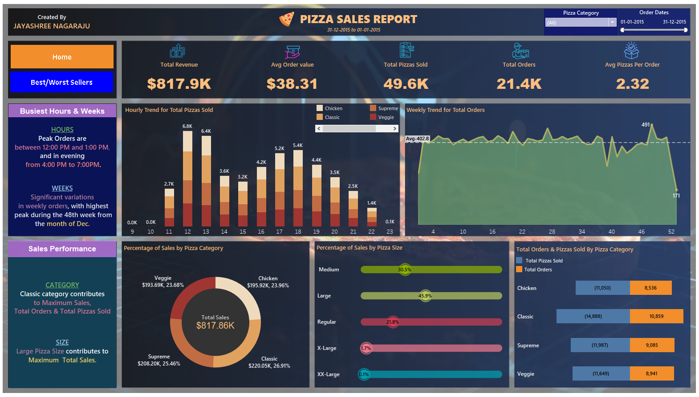
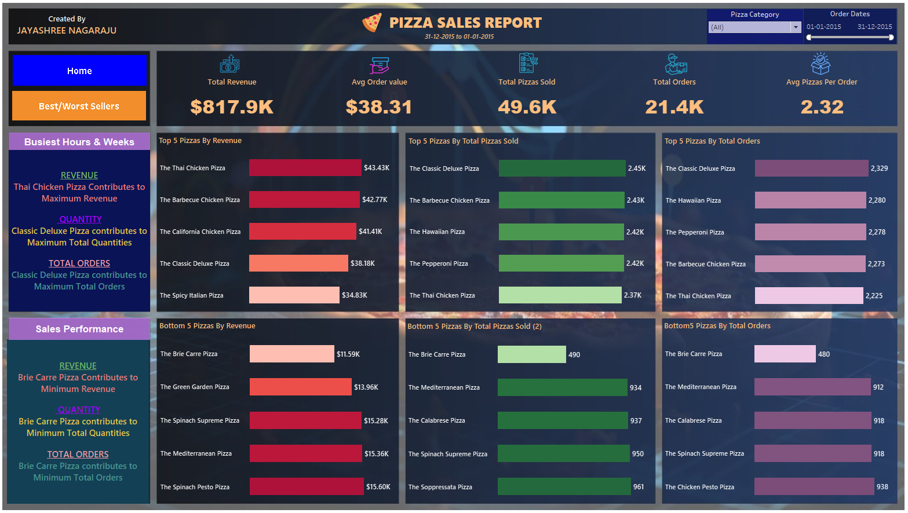

# Pizza Sales Report

## PROBLEM STATEMENT
### KPI’s REQUIREMENT

I have analyzed key indicators for the pizza sales data to gain insights into the business performance. Specifically, I have calculated the following metrics:

* Total Revenue
* Average Order Value
* Total Pizzas Sold
* Total Orders
* Average Pizzas Per Order

__click on the below images to see the report video__

